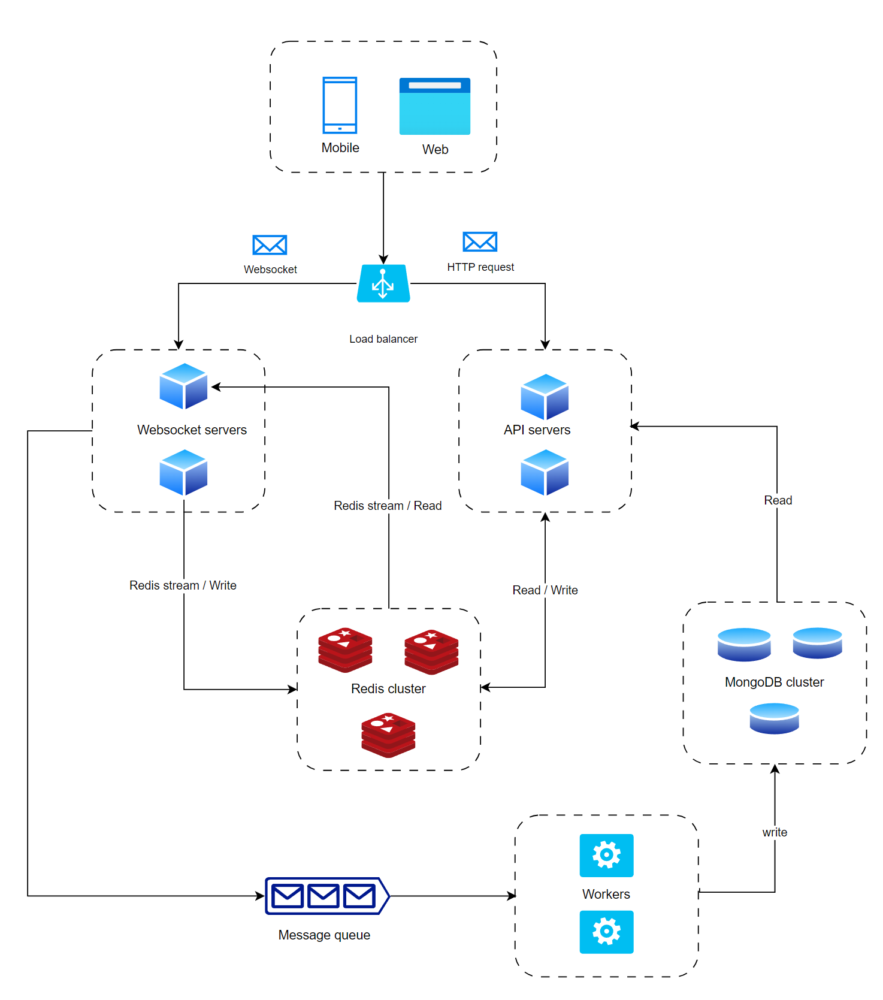

# System Design
## Architecture Diagram

## Component description

**1. Client (Mobile/Web)**: User Interface (UI) and Interaction Layer

**2. Load balancer**: Distributes incoming network requests across multiple servers

**3. Websocket servers**: Handle real-time communication between clients and the backend. It keeps a constant connection for two-way data transfer, allowing instant updates for quiz answers and leaderboard changes.

**4. API servers**: Handle requests for user data, the question list, and the leaderboard when the user first join the quiz.

**5. Redis cluster**: Stores user and leaderboard data. A cluster is used to improve performance and reliability, allowing for quick access to information and handling larger amounts of data as the app grows

**6. MongoDB cluster**: Stores user scores for the long term. It can handle heavy write operations, and eventual consistency is acceptable as a requirement since the app primarily relies on Redis

**7. Kafka message queue & workers**: A message queue that handles writes to MongoDB. It helps manage backpressure by buffering requests, ensuring the system remains responsive under heavy load

## Data flow

**1. User join a quiz**
- When a user joins a quiz, their request is sent to the **API Server**. The server processes this request, retrieves the necessary quiz data (questions, leaderboard, etc.), and sends it back to the client.

**2. WebSocket Connection**: 
- The client establishes a WebSocket connection with the WebSocket server. Upon joining the quiz, the user is assigned to a room identified by the quizID
- The room allows the server to efficiently send data updates to every user connected to that specific quiz room.

**3. User Answers Questions**:
- As the user answers questions, these responses are sent to the WebSocket server in real-time. The server receives the answers and validates them

**4. Updating Scores**:
- The WebSocket server processes the answers and then writes the updated score to Redis using the ZINCRBY command
- Sends request to the Kafka message queue to handle the write operation to the MongoDB cluster.
- Aggregate leaderboard data and send it to all clients subscribed to the leaderboard of the current quiz. To reduce the frequency of notifications about updates, implement a throttling mechanism with a 500ms delay. This helps manage the load when there are a large number of concurrent users

## Technology Justification
**NodeJS & Express.js**:NodeJs is non-blocking I/O and event-driven architecture makes it ideal for handling real-time applications like quizzes with high concurrent connections

**Socket.IO**: Enables real-time communication between client and server. It's reliable due to fallback mechanisms using HTTP long-polling, offers an easy API to manage rooms, and scales well with Redis streams for handling large numbers of users

**Redis Cluster**: 
- Great for leaderboard management due to its support for sorted sets. Since Redis is single-threaded, commands like ZINCRBY are atomic, which helps prevent race conditions. With proper settings like RDB snapshots, AOF, and an eviction policy like LRU, Redis is both fast and reliable for writing data and ensuring long-term persistence
- Redis writes are incredibly fast, and using a write-behind caching strategy can significantly improve performance by allowing writes to MongoDB asynchronously. This reduces latency during high load periods while ensuring data is eventually persisted
- It uses primary and secondary replicas for high availability, and it's easy to scale by adding more nodes to the cluster

**MongoDB cluster**: 
 - High-speed, low-latency operations and is generally faster for write loads. Beside, we don't need to support complex queries, transactions, and structured data that require ACID compliance
 - Do support atomic update using `$inc`, which is needed in this usecase

**Kafka for message queue**: Supports exactly-once processing, ensuring that each message is processed reliably without duplication. It is designed for fast throughput, allowing for quick handling of large volumes of data. Additionally, Kafka is easy to scale 